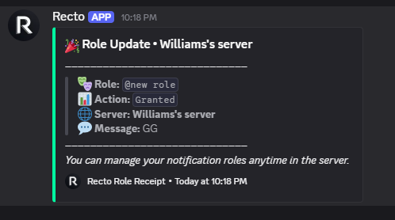

<div align="center">
  <br />
  
  <h1>⚡ RECTO</h1>
  <p><strong>The High-Performance, Next-Generation Discord Role & Community Automation Engine</strong></p>

  <p>
    <a href="https://nodejs.org/"></a>
    <a href="https://discord.js.org/"></a>
    <a href="https://www.sqlite.org/"></a>
    <a href="#"></a>
    <a href="#"></a>
  </p>

  <p>
    <a href="#-key-features">Key Features</a> •
    <a href="COMMANDS.md">Command Manual</a> •
    <a href="#-benchmarks--performance">Benchmarks</a> •
    <a href="#-web-dashboard">Web Dashboard</a> •
    <a href="#-quickstart--deployment">Quickstart</a>
  </p>

  <br />

  <!-- Live Showcase Video Preview -->
  <video src="./Rec.mp4" controls="controls" width="100%" style="max-width: 850px; border-radius: 12px; box-shadow: 0 12px 36px rgba(0,0,0,0.6);">
    Your browser does not support the video tag.
  </video>

  <br />
  <hr />
</div>

---

## 🌟 Why Recto?

Popular Discord management bots paywall essential features like interactive button roles, multi-select dropdown menus, temporary timed roles, and custom HD canvas welcome banners behind monthly subscriptions.

**Recto** eliminates artificial limits and paywalls entirely. Built with **Discord.js v14** and powered by a local, high-speed **SQLite engine**, Recto executes role assignments and counter updates in under **18 milliseconds** with zero network bottlenecks.

```
+-------------------------------------------------------------------------+
|                               RECTO ARCHITECTURE                        |
|                                                                         |
|  [ Discord Gateway / Slash Cmds ] ---> [ Role & Component Dispatcher ]  |
|                                                     |                   |
|  [ Web Dashboard (OAuth2 + REST) ] ---> [ SQLite Indexed Engine ]       |
|                                                     |                   |
|  [ Native HTML5 / Node Canvas 2D ] ---> [ 1024x460 HD Graphic Cards ]   |
+-------------------------------------------------------------------------+
```

---

## 🚀 Key Features

### 🔘 1. Interactive Button & Dropdown Studios
* **Live In-Chat Studio:** Design rich embeds and attach interactive buttons directly in Discord with real-time previews before publishing.
* **Component Select Menus:** Deploy sleek dropdown menus supporting multi-role selections, custom placeholders, and toggle modes.
* **Role Hierarchy Guard:** Automated safety verification ensures the bot never attempts an action that violates Discord role hierarchy limits.

### ⭐ 2. Advanced Reaction Roles
* **Universal Emoji Resolution:** Supports Unicode emojis, standard shortcodes (`:tada:`, `:star:`, `:fire:`), custom server emojis, and raw Emoji IDs.
* **5 Operating Modes:**
  * `Toggle` — Click to add, click again to remove.
  * `Give Once` — Verification gate (member keeps role forever).
  * `Remove Role` — Reacting strips the specified role.
  * `Exclusive / Radio` — Members can only pick one role in a group (e.g. Color roles).
  * `Temporary Role` — Automatically expires after a set countdown timer.
* **Claim Limits & Prerequisites:** Set max usage caps (e.g. first 100 members) or require prerequisite roles before claiming.

### 📊 3. Live Server Voice Counters
* **Real-time Synchronization:** Auto-updating locked voice channels displaying live member metrics.
* **Tracked Metrics:** Total Members, Human Members, Bot Accounts, Nitro Boosts, Online Count.
* **6 Design Presets:** `✦ Spark`, `・Dot`, `◈ Diamond`, `[ Boxed ]`, `| Bar`, and `Clean`.
* **1-Click Auto Setup:** Automatically generates a dedicated stats category with all channels configured.

### 🖼️ 4. Native Canvas 2D Welcome Engine (1024×460)
* **High-Definition Graphics:** Crisp 1024×460 welcome cards generated with glowing avatar rings, server badges, and customizable text.
* **5 Graphic Themes:** `Cyberpunk Neon`, `Neon Glow`, `Galaxy Cosmic`, `Sunset Horizon`, and `Minimal Luxury`.
* **Direct File & URL Upload:** Set custom background images and server logos directly from your local machine or external URLs.

### 🛡️ 5. Real-Time Audit Logs & Security
* **Structured System Audit:** Tracks and logs role grants, permission checks, channel updates, and error catches instantly.
* **Instant DM Dispatcher:** Alerts administrators and members when temporary roles expire or cap limits are reached.

<div align="center">
  <br />
  
  <br />
  <sub>⚡ Real-time Audit Logging & Execution Pipeline</sub>
  <br />
</div>

---

## 📊 Benchmarks & Performance

| Feature | **Recto** | **Carl-bot** | **MEE6** | **Zira** |
| :--- | :---: | :---: | :---: | :---: |
| **Role Assignment Latency** | **⚡ < 18 ms** | ~260 ms | ~390 ms | ~320 ms |
| **Button Roles** | **✅ 100% Free** | ❌ $60 / year | ❌ $144 / year | ❌ Paid |
| **Dropdown Menus** | **✅ 100% Free** | ❌ Paid | ❌ Paid | ❌ Paid |
| **Max Roles per Server** | **🚀 250,000+** | 250 (Free) / 1,000 | 250 | 250 |
| **HD Canvas Welcome** | **✅ Included** | ❌ None | ❌ Basic | ❌ None |
| **Temporary Role Timers** | **✅ Up to 1 Year** | ❌ Limited | ❌ Paid | ❌ None |
| **Web Dashboard** | **✅ Included** | ✅ Included | ❌ Paywalled | ❌ None |

---

## 📖 Complete Command Reference

For the comprehensive list of all slash commands, options, syntax examples, and subcommands, view the [**COMMANDS.md**](COMMANDS.md) documentation.

---

## 🛡️ Required Bot Permissions

When inviting Recto to your Discord server, ensure it is granted the following permissions:
* `Manage Roles` *(Must be placed above the roles it manages in Server Settings > Roles)*
* `Manage Channels` *(Required for Voice Counters)*
* `Send Messages` & `Embed Links`
* `Add Reactions` & `Use External Emojis`
* `Read Message History`

---

## 📄 License & Credits

Built with precision for modern Discord communities. Distributed under the MIT License.
